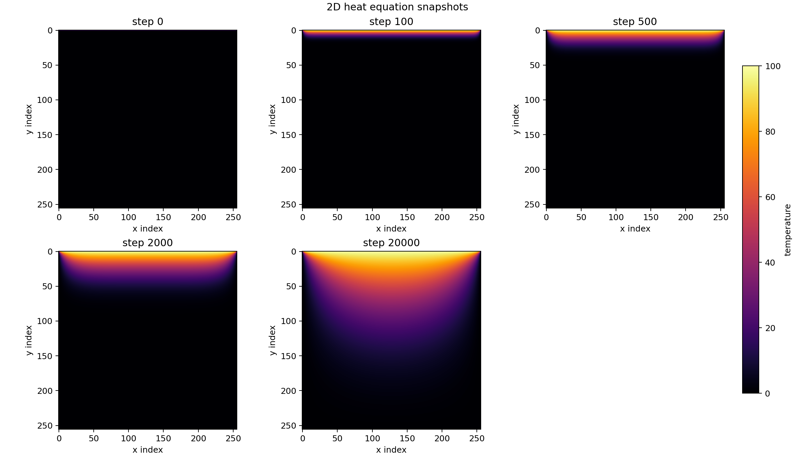
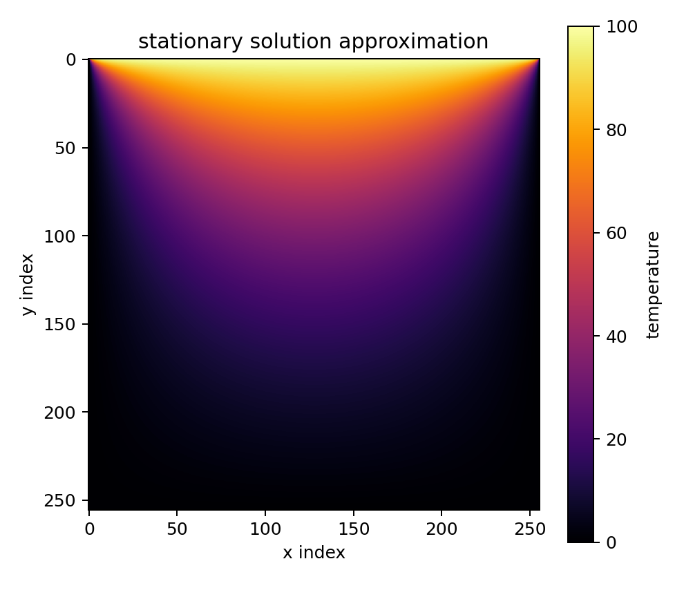
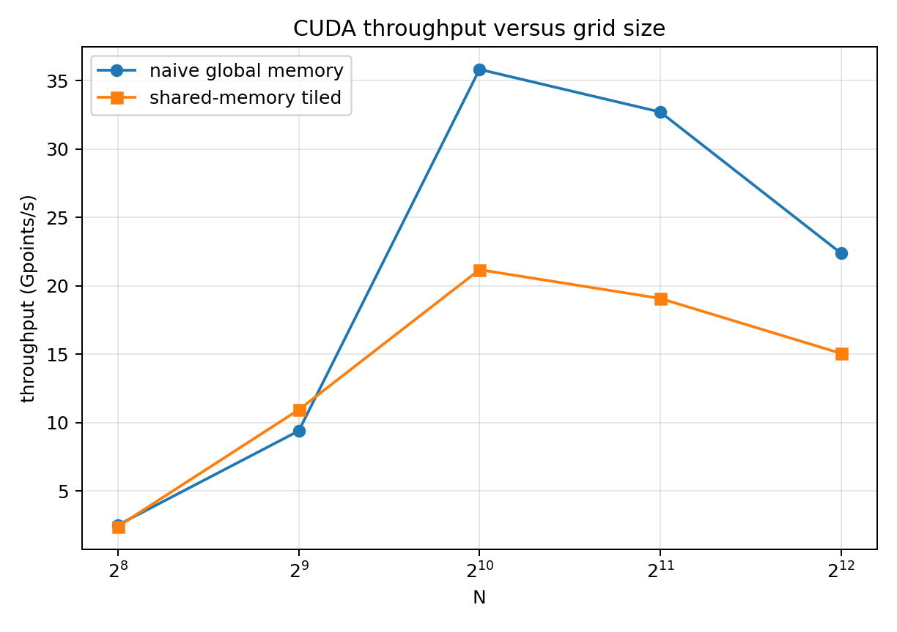
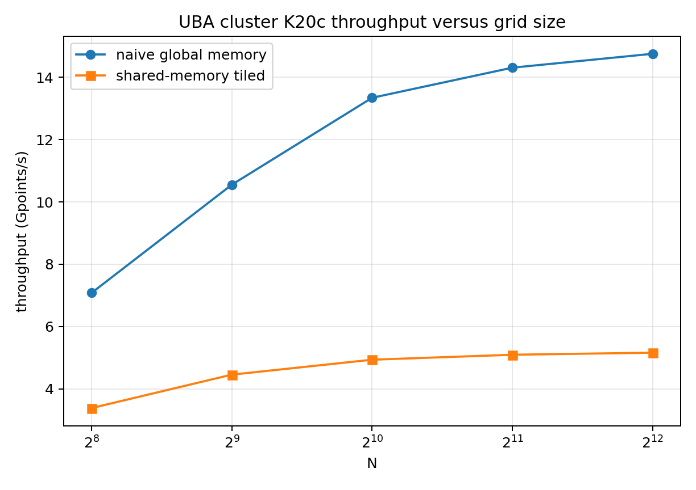

# Implementation Summary

This submission solves the 2D transient heat equation with fixed Dirichlet
boundary conditions. The top boundary is fixed at 100, the left, right, and
bottom boundaries are fixed at 0, and the interior is initialized to 0. The
corner values on the hot top edge are initialized to 50, the average of the two
adjacent boundary values. All runs use

$$
r = \alpha \Delta t / h^2 = 0.24
$$

which satisfies the 2D explicit stability limit $r \le 0.25$.

The implementation uses row-major flat arrays. The CUDA versions allocate two
device grids, update the interior points, and swap device pointers after each
time step. The host does not copy the whole grid during the time loop. For
convergence checking, the CUDA kernels write one maximum update difference per
block into `d_block_max`; the host copies only that small array every
`check_interval` steps.

# Platform

Main local platform used for the primary measurements:

| Item | Value |
|---|---:|
| CPU | AMD Ryzen 9 7940H, 8 cores / 16 threads |
| GPU | NVIDIA GeForce RTX 4060 Laptop GPU |
| CUDA compute capability | 8.9 |
| SM count | 24 |
| Max threads per block | 1024 |
| Shared memory per block | 48 KB |
| Shared memory per SM | 100 KB |
| Approx. peak FP32 | 13824.00 GFLOP/s |
| Approx. memory bandwidth | 256.03 GB/s |
| Compiler | `nvcc` 12.0, `-O3 -arch=sm_89`; `g++ -O3` |

I also ran the benchmark on the UBA CECAR cluster:

| Item | Value |
|---|---:|
| Cluster login | `odin-adm.cecar.fcen.uba.ar` |
| SLURM partition | `gpu` |
| GPU | Tesla K20c |
| CUDA compute capability | 3.5 |
| SM count | 13 |
| Max threads per block | 1024 |
| Shared memory per block | 48 KB |
| Shared memory per SM | 48 KB |
| Approx. peak FP32 | 3521.86 GFLOP/s |
| Approx. memory bandwidth | 208.00 GB/s |
| Compiler | CUDA 11.1, `-O3 -arch=sm_35`; `g++ -O3` |

# Pre-lab: Arithmetic Intensity

For one stencil update,

$$
T_{i,j}^{n+1} = T_{i,j}^{n} + r(T_{i-1,j}^{n}+T_{i+1,j}^{n}
+T_{i,j-1}^{n}+T_{i,j+1}^{n}-4T_{i,j}^{n})
$$

the floating point operation count is:

| Operation | Count |
|---|---:|
| Add four neighbors | 3 additions |
| Compute `4*T[i,j]` | 1 multiplication |
| Subtract center term | 1 subtraction |
| Multiply by `r` | 1 multiplication |
| Add old center value | 1 addition |
| Total | 7 FLOPs |

Assuming no cache reuse, the memory traffic per update is 5 reads and 1 write of
FP32 values:

$$
6 \times 4 = 24 \text{ bytes/update}
$$

Thus,

$$
I = 7/24 = 0.292 \text{ FLOP/byte}.
$$

The GPU ridge point is

$$
I_\text{ridge}=13824.00/256.03=53.99 \text{ FLOP/byte}.
$$

Since $0.292 \ll 53.99$, the stencil is memory-bound on this GPU.

On the UBA cluster Tesla K20c, the ridge point is
$3521.86/208.00=16.93$ FLOP/byte, so the same stencil is also memory-bound
there.

# Part 0: Sequential 2D Solver

The sequential solver is in `heat_serial.cpp`. It is a single-threaded CPU
reference implementation and is also used to validate the CUDA kernels. For the
stationary plot, $N=256$ converged in 46941 steps with final maximum update
$9.918213\times 10^{-5}$.

Baseline CPU timings for the later speedup comparison are:

| N | Steps | Time (ms) | Throughput (Gpt/s) |
|---:|---:|---:|---:|
| 512 | 2000 | 980.742 | 0.530 |
| 1024 | 2000 | 3843.741 | 0.543 |
| 2048 | 2000 | 15809.768 | 0.530 |

# Part A: Naive CUDA Kernel

The naive CUDA implementation is in `heat_cuda.cu`. Each CUDA thread updates
one grid point. For validation, the CUDA result at $N=256$, 500 steps, and a
16x16 block differed from the CPU reference by
$3.814697\times 10^{-6}$ in maximum absolute error.

## Block Size Exploration

All runs used $N=1024$, 2000 steps.

| Block size | Threads/block | Time (ms) | Throughput (Gpt/s) |
|---:|---:|---:|---:|
| 8x8 | 64 | 58.312 | 35.824 |
| 16x16 | 256 | 62.867 | 33.228 |
| 32x32 | 1024 | 59.460 | 35.132 |

The best block size in this table is 8x8. Smaller blocks can underperform
because they increase block scheduling overhead and may provide less work per
resident block. Larger blocks can underperform because a 1024-thread block uses
the device limit exactly, leaving fewer resident blocks per SM and less
scheduling flexibility for latency hiding.

The maximum number of threads per block on this GPU is 1024. Therefore the
32x32 configuration is legal, since $32\times 32=1024$, but it is exactly at
the limit.

Using the best 8x8 result, the effective bandwidth requested in the assignment
is:

$$
BW_\text{achieved}
= \frac{(1024-2)^2 \times 24}{58.312\text{ ms}/2000}
= 859.8 \text{ GB/s}.
$$

This is an effective stencil bandwidth using the no-cache 24 B/update model. It
is higher than the theoretical DRAM bandwidth because the naive kernel benefits
from L1/L2 cache reuse between neighboring threads; not all of those 24 bytes
are fetched from DRAM every time.

## Speedup Over Serial

This table uses the 8x8 naive configuration selected above.

| N | Serial time (ms) | Naive CUDA time (ms) | Speedup |
|---:|---:|---:|---:|
| 512 | 980.742 | 55.376 | 17.71x |
| 1024 | 3843.741 | 58.312 | 65.92x |
| 2048 | 15809.768 | 255.980 | 61.76x |

# Part B: Shared-memory Tiled Kernel

The tiled CUDA implementation is in `heat_cuda_tile.cu`. It uses dynamic shared
memory with a 1-cell halo around each tile. All stencil reads in the compute
phase come from shared memory. Corner halo elements are loaded by corner
threads. For validation at $N=256$, 500 steps, and a 16x16 tile, the maximum
absolute error against the CPU reference was $3.814697\times 10^{-6}$.

## Tile Size Exploration

All runs used $N=1024$, 2000 steps. The speedup column is relative to the best
naive result from Part A; values below 1 mean the tiled version was slower on
this GPU.

| Tile size | Time (ms) | Throughput (Gpt/s) | Speedup vs naive | Shared mem/block (KB) |
|---:|---:|---:|---:|---:|
| 8x8 | 105.182 | 19.861 | 0.554x | 0.391 |
| 16x16 | 90.313 | 23.130 | 0.646x | 1.266 |
| 32x32 | 127.187 | 16.424 | 0.458x | 4.516 |

The GPU provides 100 KB shared memory per SM and 48 KB shared memory per block.
The largest stencil tile above uses only 4.516 KB. Even including the small
reduction scratch buffer used during convergence checks, none of these tile
sizes is limited by shared memory capacity.

In principle, shared-memory tiling reduces redundant global loads because a
cell loaded into a block's shared tile can be reused by neighboring threads. On
this RTX 4060 Laptop GPU, the measured tiled kernel is not consistently faster
than the naive kernel. The likely reason is that the naive stencil uses
coalesced accesses and the hardware L1/L2 caches already capture much of the
neighbor reuse. The tiled version adds halo-loading branches and a block-wide
`__syncthreads()` every time step, which can outweigh the reduced global-memory
traffic. For small $N$, launch overhead and halo overhead are a larger
fraction of the total runtime. For large $N$, cache capacity, memory traffic,
and laptop power/clock behavior dominate.

## Throughput Versus N

The plot compares the selected naive 8x8 configuration with the best 16x16
shared-memory tile from the tile-size table.

| N | Naive 8x8 (Gpt/s) | Shared 16x16 (Gpt/s) |
|---:|---:|---:|
| 256 | 2.511 | 2.414 |
| 512 | 9.394 | 10.937 |
| 1024 | 35.824 | 21.178 |
| 2048 | 32.707 | 19.077 |
| 4096 | 22.381 | 15.058 |

Both selected configurations peak at $N=1024$ in this experiment. For small
grids the GPU is underutilized and kernel launch overhead is significant. As
the grid grows, occupancy and memory-level parallelism improve. At the largest
sizes, the working set no longer benefits as much from cache locality and the
longer laptop-GPU runs are more sensitive to memory bandwidth and power limits.

# Notes on Reduction Approach

I used a custom block-local max reduction rather than Thrust or CUB. The
reduction is simple, avoids extra dependencies, and allows the update and
maximum-difference computation to be fused in the checking kernel. The host
copies the block maxima every `check_interval` steps, not every step.

# Files

| File | Purpose |
|---|---|
| `heat_common.hpp` | Shared initialization, CPU reference solver, CSV output, result formatting |
| `heat_serial.cpp` | Sequential 2D solver |
| `heat_cuda.cu` | Naive CUDA global-memory solver |
| `heat_cuda_tile.cu` | Shared-memory tiled CUDA solver |
| `cuda_common.cuh` | CUDA error checking and device-spec helpers |
| `cuda_device_info.cu` | Platform information tool |
| `Makefile` | Build rules |
| `scripts/run_benchmarks.sh` | Reproduces validation, benchmark data, and plots |
| `scripts/plot_results.py` | Generates plots and parsed CSV |
| `scripts/run_gpu.slurm` | Example SLURM execution script |

# Encountered Problems and Solutions

The main performance surprise was that the shared-memory kernel did not
outperform the naive kernel for the larger runs. This was checked against the
CPU reference, so the issue was not a numerical error. The explanation is that
the naive kernel is highly cache-friendly on this GPU, while the tiled kernel
pays extra synchronization and halo-loading overhead. I therefore report the
measured behavior directly and describe the hardware-cache effect.

Another implementation detail was avoiding per-step host transfers. The
solution was to run a reduction only on selected checking steps and copy back
only one float per block.

# Additional UBA Cluster Results

The same code was also run on the UBA CECAR cluster with a Tesla K20c GPU. Both
CUDA kernels validated against the CPU reference at $N=256$, 500 steps, with
maximum absolute error $3.814697\times 10^{-6}$.

Cluster CPU baselines:

| N | Steps | Time (ms) | Throughput (Gpt/s) |
|---:|---:|---:|---:|
| 512 | 2000 | 16263.349 | 0.032 |
| 1024 | 2000 | 36411.615 | 0.057 |
| 2048 | 2000 | 82586.720 | 0.101 |

Naive CUDA block-size exploration on the Tesla K20c, $N=1024$, 2000 steps:

| Block size | Threads/block | Time (ms) | Throughput (Gpt/s) |
|---:|---:|---:|---:|
| 8x8 | 64 | 239.536 | 8.721 |
| 16x16 | 256 | 156.582 | 13.341 |
| 32x32 | 1024 | 191.906 | 10.885 |

The best K20c naive block size was 16x16. Its effective bandwidth by the
assignment's 24 B/update estimate is $13.341076 \times 24 = 320.2$ GB/s,
again an effective bandwidth that includes cache reuse.

Shared-memory tile-size exploration on the Tesla K20c, $N=1024$, 2000 steps:

| Tile size | Time (ms) | Throughput (Gpt/s) | Speedup vs naive | Shared mem/block (KB) |
|---:|---:|---:|---:|---:|
| 8x8 | 794.778 | 2.628 | 0.197x | 0.391 |
| 16x16 | 422.890 | 4.940 | 0.370x | 1.266 |
| 32x32 | 471.476 | 4.431 | 0.332x | 4.516 |

Cluster speedup over the cluster serial baseline, using naive 16x16:

| N | Serial time (ms) | Naive CUDA time (ms) | Speedup |
|---:|---:|---:|---:|
| 512 | 16263.349 | 49.298 | 329.90x |
| 1024 | 36411.615 | 156.582 | 232.54x |
| 2048 | 82586.720 | 585.159 | 141.14x |

| N | Naive 16x16 (Gpt/s) | Shared 16x16 (Gpt/s) |
|---:|---:|---:|
| 256 | 7.080 | 3.384 |
| 512 | 10.552 | 4.457 |
| 1024 | 13.341 | 4.936 |
| 2048 | 14.308 | 5.096 |
| 4096 | 14.754 | 5.162 |

On this older Kepler GPU, the naive kernel still outperformed the hand-tiled
shared-memory kernel. The shared-memory version pays relatively high halo and
synchronization overhead, while the naive access pattern remains coalesced and
cache-friendly.
